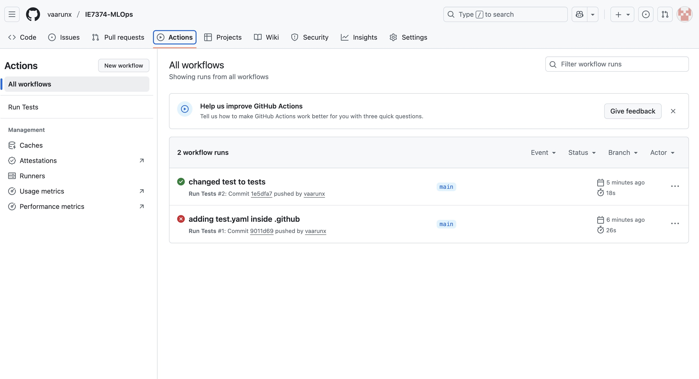
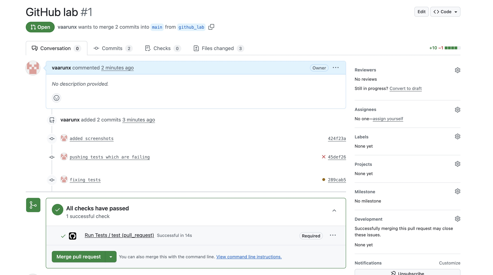
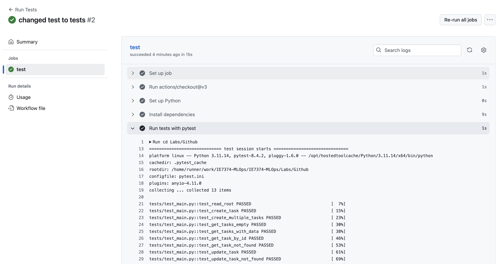

# FastAPI Task Management API

A simple REST API for managing tasks with automated testing using GitHub Actions.

## GitHub Actions Dashboard



## Test Results

### Passing Tests


### Successful Actions


### Failed Test Example


## Structure

```
Github/
├── src/
│   └── main.py          # FastAPI application
└── test/
    └── test_main.py     # Pytest test suite
```

## API Endpoints

- `GET /` - Welcome message
- `POST /tasks` - Create a task
- `GET /tasks` - Get all tasks
- `GET /tasks/{id}` - Get specific task
- `PUT /tasks/{id}` - Update a task
- `DELETE /tasks/{id}` - Delete a task

## Running Locally

```bash
# Install dependencies
pip install -r requirements.txt

# Run the API
python3 src/main.py

# Run tests
cd Labs/Github
pytest -m tests/test_main.py -v
```

## CI/CD

Tests run automatically on any pull requests to `main` branches via GitHub Actions.

### Branch Protection

The `main` branch is protected with the following rules:
- Pull requests required before merging
- All tests must pass before merging
- Branch must be up to date with main before merging

### Workflow

```bash
# Create feature branch
git checkout -b feature/your-feature

# Make changes and commit
git add .
git commit -m "Add your feature"
git push origin feature/your-feature

# Open PR on GitHub
# Tests will run automatically
# Merge after tests pass
```
