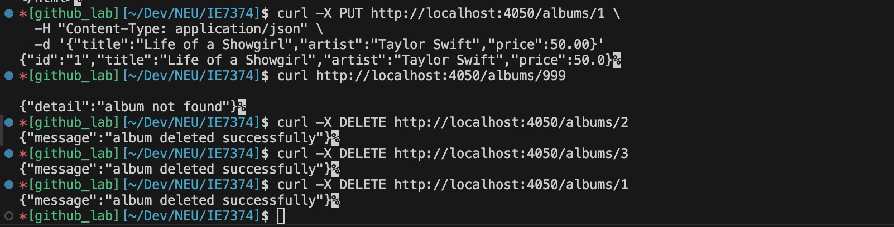
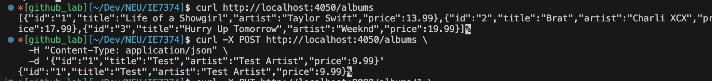
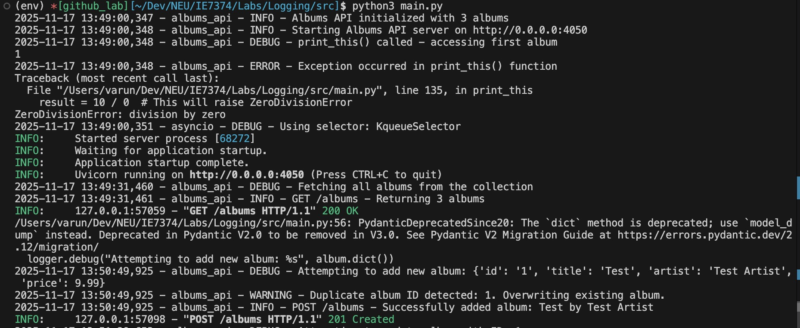
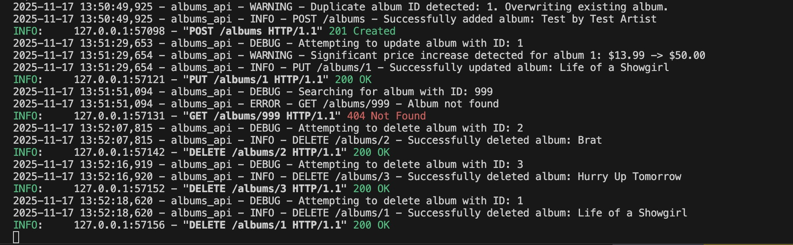

### Logging
Learning Python logging fundamentals for monitoring and debugging applications.

#### Setup
Install required dependencies:

```
pip install -r requirements.txt
```

#### Running the Application
Navigate to the lab folder and start the FastAPI server:

```
python main.py
```

The API will be available at http://localhost:8080

All logs will be displayed in the console and saved to `albums_api.log`

#### Testing Different Log Levels

**DEBUG & INFO - Get all albums:**
```
curl http://localhost:8080/albums
```

**WARNING - Add album with duplicate ID:**
```
curl -X POST http://localhost:8080/albums \
  -H "Content-Type: application/json" \
  -d '{"id":"1","title":"Test Album","artist":"Test Artist","price":9.99}'
```

**WARNING - Update with significant price increase:**
```
curl -X PUT http://localhost:8080/albums/1 \
  -H "Content-Type: application/json" \
  -d '{"title":"Life of a Showgirl","artist":"Taylor Swift","price":50.00}'
```

**ERROR - Try to get non-existent album:**
```
curl http://localhost:8080/albums/999
```

**CRITICAL - Delete the last remaining album:**
```
curl -X DELETE http://localhost:8080/albums/2
curl -X DELETE http://localhost:8080/albums/3
curl -X DELETE http://localhost:8080/albums/1
```

**EXCEPTION - Logged automatically on startup** (from `print_this()` function)

#### Viewing Logs

**Real-time console output:**
Check the terminal where you ran `python main.py`

**View log file:**
```
cat albums_api.log
```

**Monitor log file in real-time:**
```
tail -f albums_api.log
```

#### Log Levels Demonstrated
- **DEBUG**: Detailed information for debugging (fetching albums, searching by ID)
- **INFO**: General informational messages (successful operations, server startup)
- **WARNING**: Potential issues detected (duplicate IDs, suspicious price changes)
- **ERROR**: Error events (album not found, failed operations)
- **CRITICAL**: Critical situations (deleting last album in collection)
- **EXCEPTION**: Full traceback of exceptions (division by zero in print_this)

#### Checking Logs

After running the test commands, you can view all the logged events in two places:

**Console output:**
Check the terminal where you started the server with `python src/main.py`

**Log file:**
```
cat src/albums_api.log
```

The logs will show the timestamp, logger name, log level, and message for each event that occurs in your application.

#### Results



